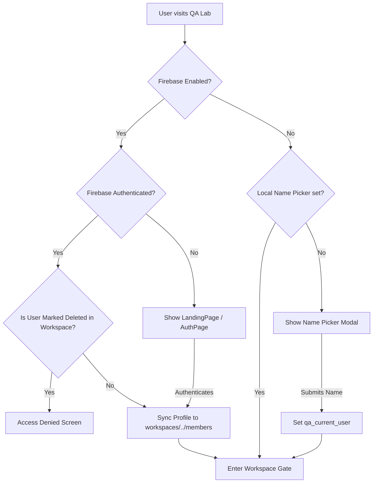
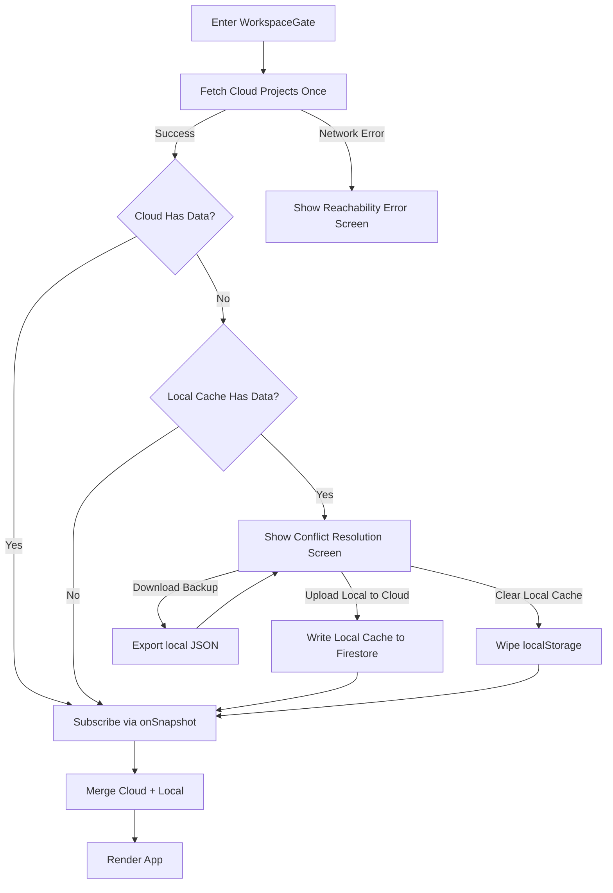
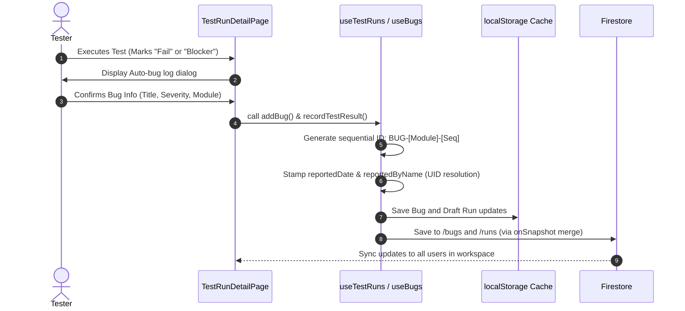

# QA Lab — Application Flow & Architecture Document

This document outlines the architecture, data models, code structure, and logical flows of the **QA Lab** application. It serves as a developer guide for understanding the system.

---

## 1. System Overview

**QA Lab** is a collaborative, lightweight test case management and defect tracking application built for agile product development teams. It operates as a modern alternative to legacy tools (like TestRail, Zephyr) or unstructured spreadsheets.

### Core Value Propositions
* **Lightweight & High Efficiency:** Streamlined interface with instant responsive interactions.
* **Offline-Ready Cache with Cloud Sync:** Local storage acts as a workspace-scoped local cache, while Firebase Firestore functions as the authoritative source of truth.
* **Continuous Release Readiness:** Automated health assessments based on test execution rates, pass rates, and blocker bugs.
* **Low-Friction Collaboration:** Built-in activity logging, automated bug-linking during test runs, and multi-user synchronization.

---

## 2. Technology Stack

* **Frontend Framework:** React (built using Vite, using `HashRouter` for client-side routing).
* **Styling:** Vanilla CSS (responsive grid-aligned dashboards, modern typography, color-coded health badges).
* **Database & Auth:** Firebase Firestore (Authoritative data store) + Firebase Auth (Google OAuth, Guest logins).
* **Caching:** Namespaced `localStorage` keys per workspace to prevent data cross-contamination.
* **Packaging & Scripts:** NPM-managed dependencies (configured in [package.json](file:///c:/Users/ccl15/Documents/Jazz%20Project/pandabugs/pandalabs/package.json)).

---

## 3. Data Model & Collections

The data layer is partitioned by workspace (`VITE_QA_WORKSPACE_ID`). The database collections are structured hierarchically in Firestore:

```
workspaces/{workspaceId}
  ├── members/ (User profiles synced on login)
  │     └── {userId} -> { uid, name, email, photoURL, lastSeenAt }
  ├── teamMembers/ (Workspace-level QA team assignments & roles)
  │     └── {memberId} -> { id, uid, name, role, email, updatedAt }
  ├── projects/ (Project entities)
  │     └── {projectId}
  │           │   (Fields: id, name, description, memberIds, createdAt)
  │           ├── testCases/ (Suite of test cases)
  │           │     └── {caseId} -> { title, module, scenario, preconditions, priority, steps[], expected, status, evidenceLinks[] }
  │           ├── bugs/ (Linked defects)
  │           │     └── {bugId} -> { id, title, description, severity, status, linkedTestCase, reportedDate, reportedByName }
  │           └── runs/ (Historical execution logs)
  │                 └── {runId} -> { name, build, date, completedAt, executedBy, total, passed, failed, cases[] }
  └── activities/ (Workspace audit trail)
        └── {activityId} -> { entityType, entityId, projectId, action, title, actor, createdAt, before, after }
```

---

## 4. Key Workflows & Information Flows

### A. Authentication & Lifecycle Entry


---

### B. Workspace Gate & Bidirectional Sync Flow
To resolve conflicts and handle offline/online states, the `WorkspaceGate` intercepts the app loading process:



### C. Test Run & Defect Lifecycle


---

## 5. Main Component Map

### Core Pages
1. **[LandingPage](file:///c:/Users/ccl15/Documents/Jazz%20Project/pandabugs/pandalabs/src/pages/LandingPage.jsx):** Welcoming portal featuring product benefits.
2. **[AuthPage](file:///c:/Users/ccl15/Documents/Jazz%20Project/pandabugs/pandalabs/src/pages/AuthPage.jsx):** Secure sign-in page using Google provider.
3. **[DashboardPage](file:///c:/Users/ccl15/Documents/Jazz%20Project/pandabugs/pandalabs/src/pages/DashboardPage.jsx):** Quick-glance metrics including Active Blockers, High-Priority Bugs, Recent Runs, and Project Health status.
4. **[ProjectsPage](file:///c:/Users/ccl15/Documents/Jazz%20Project/pandabugs/pandalabs/src/pages/ProjectsPage.jsx):** Workspace projects dashboard with project creation, updating, and deletions.
5. **[TestCasesPage](file:///c:/Users/ccl15/Documents/Jazz%20Project/pandabugs/pandalabs/src/pages/TestCasesPage.jsx):** Management page for all test cases, structured by modules. Supports CSV uploads, keyword search, priority filter, and bulk editing.
6. **[TestCaseDetailPage](file:///c:/Users/ccl15/Documents/Jazz%20Project/pandabugs/pandalabs/src/pages/TestCaseDetailPage.jsx):** Granular detail card displaying test steps, preconditions, linked bugs, and attachment history (using `evidenceLinks`).
7. **[TestRunsPage](file:///c:/Users/ccl15/Documents/Jazz%20Project/pandabugs/pandalabs/src/pages/TestRunsPage.jsx):** Run planner that lists ongoing drafts and historical execution reports.
8. **[TestRunDetailPage](file:///c:/Users/ccl15/Documents/Jazz%20Project/pandabugs/pandalabs/src/pages/TestRunDetailPage.jsx):** Step-by-step runner interface.
9. **[BugTrackerPage](file:///c:/Users/ccl15/Documents/Jazz%20Project/pandabugs/pandalabs/src/pages/BugTrackerPage.jsx):** Unified project defect log supporting exports, filters, status toggles, and manual logging.
10. **[RequirementsPage](file:///c:/Users/ccl15/Documents/Jazz%20Project/pandabugs/pandalabs/src/pages/RequirementsPage.jsx):** Mapping of core requirements.
11. **[RequirementCoverageMatrixPage](file:///c:/Users/ccl15/Documents/Jazz%20Project/pandabugs/pandalabs/src/pages/RequirementCoverageMatrixPage.jsx):** Matrix tracking mapping coverage between Test Cases and Requirements.
12. **[ProjectReportsPage](file:///c:/Users/ccl15/Documents/Jazz%20Project/pandabugs/pandalabs/src/pages/ProjectReportsPage.jsx):** Single project quality analytics.
13. **[ReportsPage](file:///c:/Users/ccl15/Documents/Jazz%20Project/pandabugs/pandalabs/src/pages/ReportsPage.jsx):** Cross-project "Release Readiness" portal assessing product health.
14. **[ActivityPage](file:///c:/Users/ccl15/Documents/Jazz%20Project/pandabugs/pandalabs/src/pages/ActivityPage.jsx):** Log of mutations showing before/after details.
15. **[BackupPage](file:///c:/Users/ccl15/Documents/Jazz%20Project/pandabugs/pandalabs/src/pages/BackupPage.jsx):** Offline JSON imports & exports.

---

## 6. Shared Utilities & State Hooks

* **[useRemoteSync](file:///c:/Users/ccl15/Documents/Jazz%20Project/pandabugs/pandalabs/src/hooks/useRemoteSync.js):** Determines connection validity to Cloud Firestore.
* **[useWorkspaceSync](file:///c:/Users/ccl15/Documents/Jazz%20Project/pandabugs/pandalabs/src/context/WorkspaceSyncContext.jsx):** Controls conflict gate state on initial app load.
* **[reportMetrics.js](file:///c:/Users/ccl15/Documents/Jazz%20Project/pandabugs/pandalabs/src/utils/reportMetrics.js):** The unified math calculator for health statuses (`deriveHealth`), release readiness scores, bug severities, and case execution rates. Unifies math across Dashboard, Project Cards, and Release Readiness reports.
* **[storage.js](file:///c:/Users/ccl15/Documents/Jazz%20Project/pandabugs/pandalabs/src/utils/storage.js):** Handles JSON localStorage actions, offline fallback keys, and deletes with soft-tombstones.
* **[remoteStorage.js](file:///c:/Users/ccl15/Documents/Jazz%20Project/pandabugs/pandalabs/src/utils/remoteStorage.js):** Handles collections CRUD, snapshot hooks, batch transactions, user profile syncing, and workspace clearing.
* **[export.js](file:///c:/Users/ccl15/Documents/Jazz%20Project/pandabugs/pandalabs/src/utils/export.js):** Generates structured CSV outputs for bug tables, parsing Firebase IDs and transforming user hashes into readable names using the `getReporterName` utility.

---

## 7. Development Guidelines

1. **Keep localStorage Workspace-Namespaced:** Always prefix cache storage keys using the `cachePrefix()` utility inside [storage.js](file:///c:/Users/ccl15/Documents/Jazz%20Project/pandabugs/pandalabs/src/utils/storage.js).
2. **Handle Deletions via Soft-Deletes:** Never perform hard deletes of primary records directly in localStorage. Instead, mark records as `{ deleted: true }` and save them. Let sync propagate tombstones to other clients.
3. **Use Shared Metrics calculations:** Never calculate pass rates, health, or bug statuses locally in React components. Call functions inside [reportMetrics.js](file:///c:/Users/ccl15/Documents/Jazz%20Project/pandabugs/pandalabs/src/utils/reportMetrics.js) to avoid data drift.
4. **Firebase Security:** Firestore write transactions must validate auth states and verify workspace IDs.
